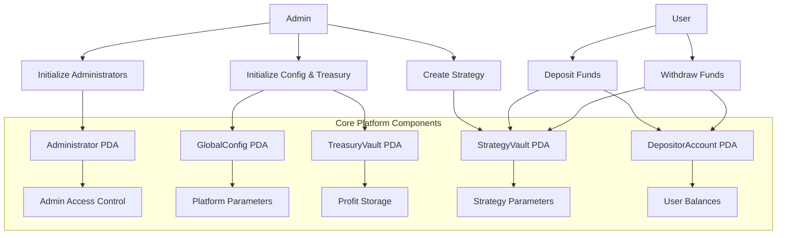
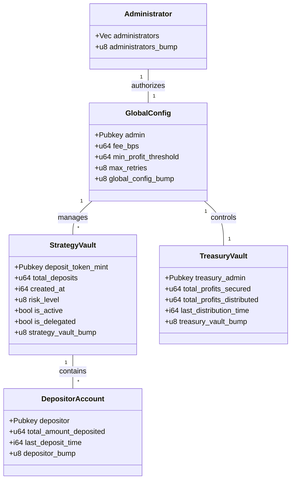

# Intra-Pool Arbitrage Platform

## Platform Architecture

```mermaid
flowchart TD
    A[User] --> D[Deposit Funds]
    A --> E[Withdraw Funds]
    
    Admin[Admin] --> B[Initialize Administrators]
    Admin --> C[Initialize Config & Treasury]
    Admin --> G[Create Strategy]
    
    B --> F[Administrator PDA]
    C --> H[GlobalConfig PDA]
    C --> I[TreasuryVault PDA]
    G --> J[StrategyVault PDA]
    D --> K[DepositorAccount PDA]
    D --> J
    E --> K
    E --> J
    
    subgraph "Core Platform Components"
        F --> L[Admin Access Control]
        H --> M[Platform Parameters]
        I --> N[Profit Storage]
        J --> O[Strategy Parameters]
        K --> P[User Balances]
    end
```

## Data Model

```mermaid
classDiagram
    class Administrator {
        +Vec<Pubkey> administrators
        +u8 administrators_bump
    }

    class GlobalConfig {
        +Pubkey admin
        +u64 fee_bps
        +u64 min_profit_threshold
        +u8 max_retries
        +u8 global_config_bump
    }
    
    class StrategyVault {
        +Pubkey deposit_token_mint
        +u64 total_deposits
        +i64 created_at
        +u8 risk_level
        +bool is_active
        +bool is_delegated
        +u8 strategy_vault_bump
    }
    
    class DepositorAccount {
        +Pubkey depositor
        +u64 total_amount_deposited
        +i64 last_deposit_time
        +u8 depositor_bump
    }
    
    class TreasuryVault {
        +Pubkey treasury_admin
        +u64 total_profits_secured
        +u64 total_profits_distributed
        +i64 last_distribution_time
        +u8 treasury_vault_bump
    }
    
    Administrator "1" -- "1" GlobalConfig: authorizes
    GlobalConfig "1" -- "*" StrategyVault: manages
    StrategyVault "1" -- "*" DepositorAccount: contains
    GlobalConfig "1" -- "1" TreasuryVault: controls
```

## Transaction Flow

```mermaid
flowchart TD
    User --> Deposit[user_deposit]
    User --> Withdraw[user_withdraw]
    
    Admin --> InitAdmins[init_admins]
    Admin --> InitConfig[init_config_treasury]
    Admin --> CreateStrategy[create_strategy]
    
    InitAdmins --> Administrator[Administrator PDA]
    InitConfig --> GlobalConfig[GlobalConfig PDA]
    InitConfig --> TreasuryVault[TreasuryVault PDA]
    CreateStrategy --> StrategyVault[StrategyVault PDA]
    CreateStrategy --> VaultToken[Vault Token Account]
    
    Deposit --> DepositorAccount[DepositorAccount PDA]
    Deposit --> TokenTransferD[Transfer Tokens to Vault]
    Deposit --> UpdateVaultD[Update Strategy Vault]
    Deposit --> DepositEvent[Emit DepositEvent]
    
    Withdraw --> UpdateDepositor[Update Depositor Balance]
    Withdraw --> TokenTransferW[Transfer Tokens to User]
    Withdraw --> UpdateVaultW[Update Strategy Vault]
    Withdraw --> WithdrawEvent[Emit WithdrawEvent]
    
    subgraph "Transaction Flow"
        InitAdmins
        InitConfig
        CreateStrategy
        Deposit
        Withdraw
    end
```